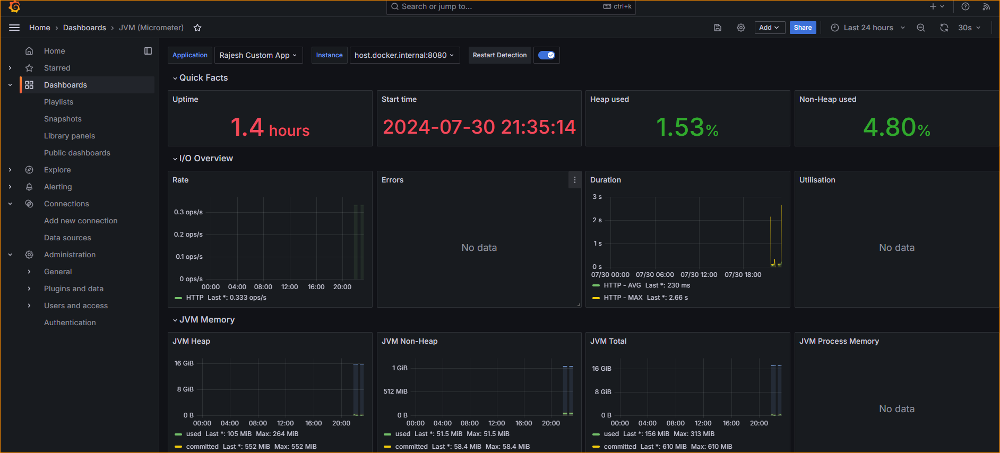
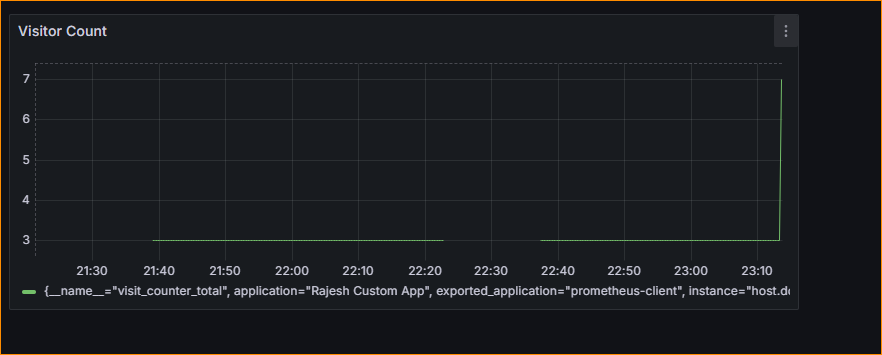

# Getting Started

### Reference Documentation
For further reference, please consider the following sections:

* [Official Apache Maven documentation](https://maven.apache.org/guides/index.html)
* [Spring Boot Maven Plugin Reference Guide](https://docs.spring.io/spring-boot/3.3.2/maven-plugin)
* [Create an OCI image](https://docs.spring.io/spring-boot/3.3.2/maven-plugin/build-image.html)
* [Spring Boot Actuator](https://docs.spring.io/spring-boot/docs/3.3.2/reference/htmlsingle/index.html#actuator)
* [Prometheus](https://docs.spring.io/spring-boot/docs/3.3.2/reference/htmlsingle/index.html#actuator.metrics.export.prometheus)

### Guides
The following guides illustrate how to use some features concretely:

* [Building a RESTful Web Service with Spring Boot Actuator](https://spring.io/guides/gs/actuator-service/)

### Project Running Demo

1.  docker network create grafana-prometheus
1.  docker run --name my-prometheus  --network grafana-prometheus --network-alias prometheus   --mount type=bind,source=C:/work/setup/prometheus/prometheus.yml,destination=/etc/prometheus/prometheus.yml -p 9095:9090 prom/prometheus

PROMETHEUS SCRAPES metrics from application by polling

1.  |

    <http://localhost:9095/targets?search=>

    |

    Confirm if prometheus runs and shows docker metrics

    |

1.  docker run --rm --name grafana2 --network grafana-prometheus --network-alias grafana --publish 3000:3000 --detach grafana/grafana-oss:latest
2.  |

    <http://localhost:3000>

    |

    Confirm if Grafana is running

    |

1.  To display Prometheus metrics in Grafana:

1.  Log into Grafana (default username "admin" and password "admin").
2.  Go to Configuration > Data sources
3.  Click Add data source
4.  Pick Prometheus as the data type
5.  Set the URL as <http://prometheus:9090> and click Save & test down the bottom.
6.  We use "prometheus" instead of "localhost" because that's the internal network name for our Prometheus container (within the network "grafana-prometheus").

*From <<https://www.linkedin.com/pulse/running-grafana-prometheus-docker-stephen-townshend/>>*

1.  Run The spring Boot app

